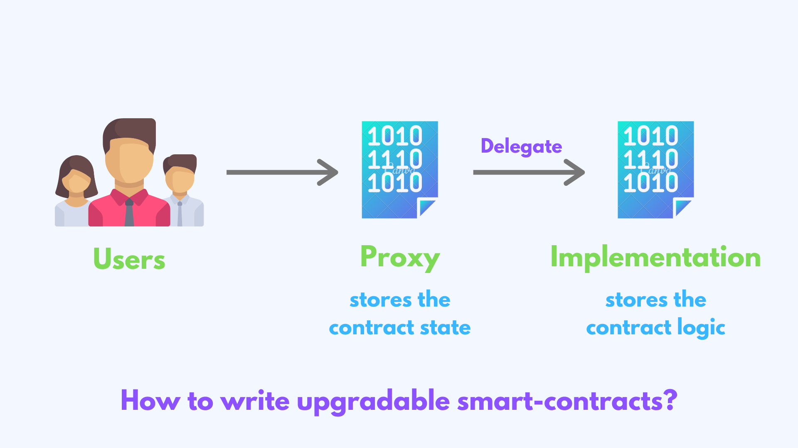
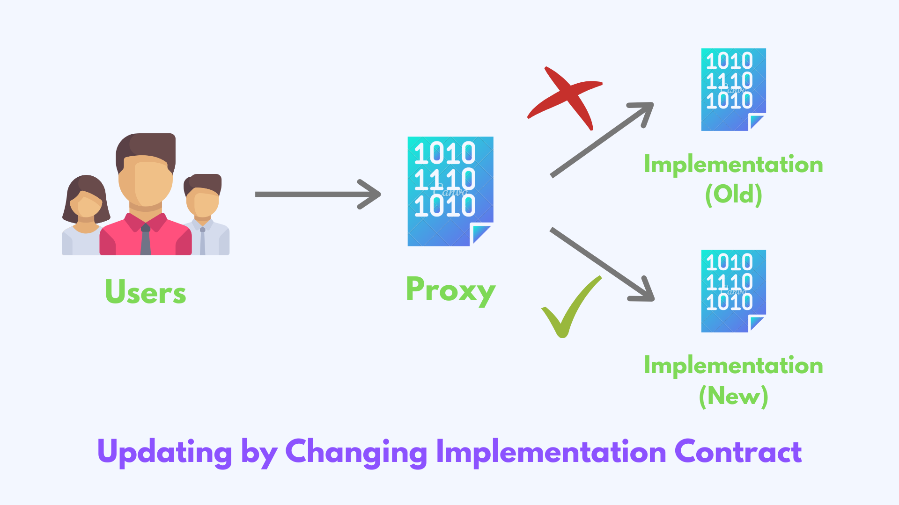

# Understanding ERC7201: Bringing Namespaced Storage to Smart Contracts
### Why GroupOS and OpenZeppelin's newly released contracts use namespaced storage and why you should, too
#### Authored by [Station Labs](https://groupos.xyz), the team behind [GroupOS](https://github.com/0xstation/groupos) and [0xRails](https://github.com/0xStation/0xrails/) protocols.

## Introduction

By now, you might've heard the buzz around OpenZeppelin's highly anticipated contracts release: version 5.0. The fabulous folks over at OZ have implemented a number of improvements to their smart contracts, one of which is [ERC-7201](https://eips.ethereum.org/EIPS/eip-7201).

We've seen the far-reaching implications that new ERCs like ERC721 and ERC20 can have on the market at large, so let's take a deep dive on the lesser-known ERC7201.

## Table of Contents

  - [Introduction](#introduction)
  - [Table of Contents](#table-of-contents)
  - [Namespaced Storage Overview](#namespaced-storage-overview)
  - [Eliminating an entire class of hacks](#eliminating-an-entire-class-of-hacks)
  - [Code example](#code-example)
  - [Retrieving namespaced storage](#retrieving-namespaced-storage)
  - [Gas considerations](#gas-considerations)
  - [In conclusion](#in-conclusion)

## Namespaced Storage Overview
Namespaced storage, introduced by [ERC7201](https://eips.ethereum.org/EIPS/eip-7201), is a methodology for EVM smart contracts devised to prevent conflicts that can arise with data storage.

It provides a structured and organized way to manage state variables, which can be particularly useful in large, complex software systems where a single developer mistake can cost users millions of dollars. One such example was the [Audius protocol hack in July 2022](https://decrypt.co/105913/how-audius-was-hacked-6m-ethereum-tokens), which resulted in damages topping $6 million.

By using namespaced storage, contracts identify categories of state variables (in the form of structs) which are assigned to a 'namespace' within storage, effectively isolating them from one another. This prevents any potential conflicts or collisions between state variables when introducing new ones or upgrading/deprecating old ones.

## Eliminating an entire class of hacks
One of the main issues that namespaced storage can solve is proxy storage collisions. Since they separate state storage from code logic into two or more smart contracts, proxies offer numerous benefits to using standalone contracts.



In the context of proxies, a storage collision can occur when two different contracts unintentionally try to access or modify the same storage slot.

Isolating related state variables to their own sandboxed namespaces also aids with securing upgradeable contracts, which similarly require meticulous management of storage when introducing or deprecating state variables.



In both scenarios, this can lead to unexpected behavior, data corruption, and serious security vulnerabilities.

In the current web3 ecosystem, proxies and upgradeable contracts are ubiquitous. These kinds of contracts are used by the biggest stablecoins, centralized exchanges, NFT projects, and ERC20 tokens in the ecosystem. Namespaced storage aims to catalyze a huge security improvement across the whole industry.

### Code example

The technical reasoning for the namespace's code derivation is beyond the scope of this blog post, but in short it can be done in a few lines of code. Here's an example from [our 0xRails protocol](https://github.com/0xStation/0xrails/):

```solidity
library InitializableStorage {
    /// @custom:storage-location erc7201:0xrails.Initializable
    struct Layout {
        bool _initialized;
        bool _initializing;
    }

    bytes32 internal constant INITIALIZABLE_STORAGE_SLOT =
        keccak256(abi.encode(
          uint256(keccak256("0xrails.Initializable")) - 1)
        ) & ~bytes32(uint256(0xff));
}
```

First, ERC-7201 storage is declared in the NatSpec comment at the top of the contract. Custom NatSpec tags were added as part of Solidity 0.8.20, so keep in mind this may throw a compiler error if using earlier versions than 0.8.20.

Second, a struct of related variables pertaining to a named category is defined, in this case two booleans `_initialized` and `_initializing` which relate to `erc7201:0xrails.Initializable` as notated in the NatSpec. This string can be anything you like however, such as `erc7201:donut.fruitloop`, which would be a strange namespace for a contract to use. 

Third, this string is hashed, decremented, conjoined bitwise with `~bytes32(0xff)` using the AND operator (&), and the result hashed again. These steps are simply to ensure sufficient entropy and prevent storage slot collisions.

### Retrieving namespaced storage

The final 32 byte output of the steps outlined above is the storage slot where the struct will be stored according to [the default Solidity storage rules for static and dynamic types](https://docs.soliditylang.org/en/latest/internals/layout_in_storage.html).

To retrieve storage from that slot, use a single line of assembly to instantiate a pointer that accesses the slot directly. Here's an example:

```solidity
    function layout() internal pure returns (Layout storage l) {
        assembly {
            l.slot := INITIALIZABLE_STORAGE_SLOT
        }
    }
```

From there, struct members can be accessed to your needs using the following:

```bool initialized = l._initialized```

or 

```bool initializing = l._initializing```

## Gas considerations

As a dapp developer, you may be asking: "But aren't there gas optimization drawbacks to using a Solidity struct in storage this way?" Fear not, because storage pointers are cheap!

It is true that loading an entire struct into memory from a namespaced storage slot would indeed introduce gas inefficiencies in the case that you don't need all the struct's members for an operation. Depending on the size of the struct, improper management like this can cause significant gas costs (the computational expense required to execute operations on the Ethereum network).

It's like if you have a scrumptious donut recipe that calls for crushed Froot-Loops as a topping, but you order the 8-pack variety pack of cereals that includes Frosted Flakes and Apple Jacks. 


There's no use for the variety pack's other cereals in the recipe, so you just discard them- what a waste! Instead, just order a single box of Froot-Loops!

Rather than loading the struct into memory in its entirety and discarding unused members, the best practice for namespaced storage is to instead utilize storage pointers, as outlined in the code examples above. This way, a pointer acts as an indicator for the entire struct without actually loading it, so you can access only the member(s) of the struct that you need.

For more examples demonstrating this Solidity gas optimization quirk, check out [this storage pointer tutorial by Rareskills](https://www.rareskills.io/post/gas-optimization#viewer-48pfu)

## In conclusion
Namespaced storage enhances code clarity, readability, and eliminates an entire class of smart contract vulnerabilities. By encapsulating data within specific namespaces, developers can more easily understand which parts of the contract interact with which data, making the code easier to read, maintain, and debug. It presents a solution for preventing storage collisions, which makes it a valuable tool for developing efficient, secure, and maintainable smart contracts.

The Web3 & crypto industry has suffered enough hacks, for the sake the entire ecosystem's safety, join [GroupOS](https://groupos.xyz) and OpenZeppelin in using ERC7201 namespaced storage in your next smart contract project!

---

_I hope you enjoyed this post on ERC7201! If you have any questions or comments, please feel free to reach out below._

_[Markus Osterlund <br> Solidity @ Station Labs](https://github.com/robriks)_
